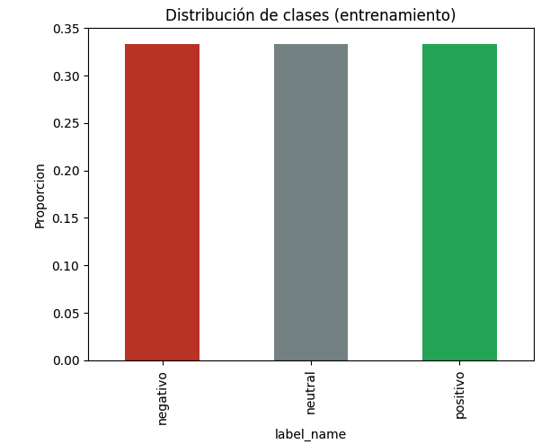
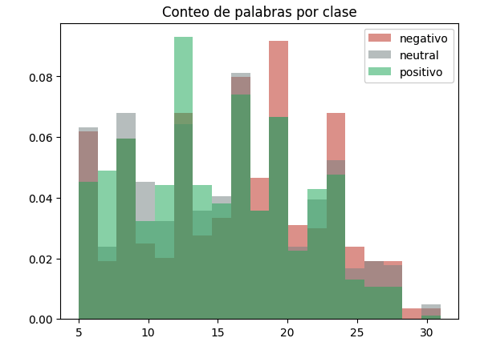
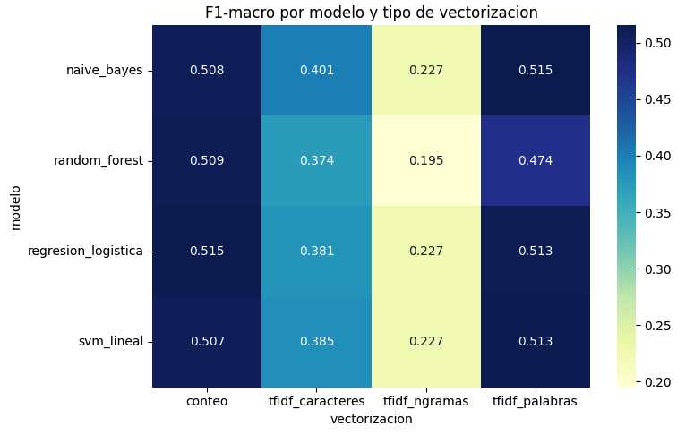
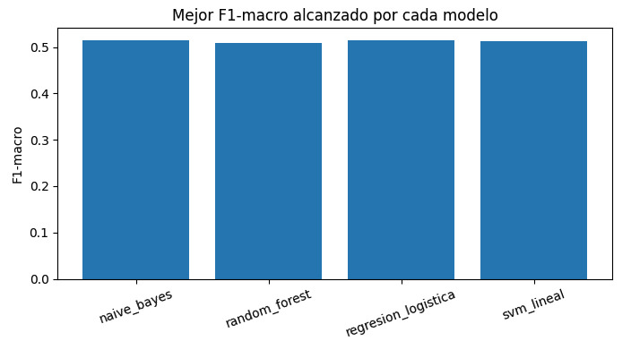
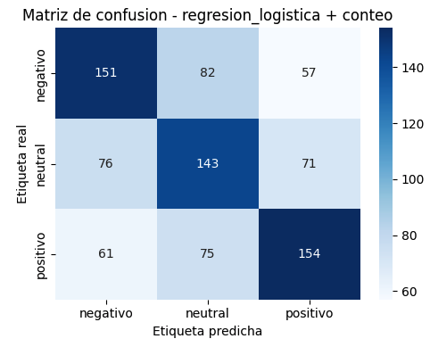

# Reporte: Diseño de experimentos para clasificación de texto en español

## 1. Introducción y objetivo

El objetivo de este trabajo es diseñar y ejecutar un conjunto de experimentos que
comparen distintas representaciones vectoriales de texto y distintos modelos de
clasificación, con el fin de identificar qué combinación logra el mejor
desempeño en una tarea de clasificación de sentimiento sobre texto en español.

## 2. Dataset

Se utilizó el dataset **tweet_sentiment_multilingual** (configuración
**español**), publicado por CardiffNLP y disponible en Hugging Face:
https://huggingface.co/datasets/cardiffnlp/tweet_sentiment_multilingual

- Tweets en español etiquetados con sentimiento: **negativo**, **neutral** y
  **positivo**.
- Tamaño de entrenamiento: **1,839**.
- Tamaño de prueba: **870**.
- Las clases están balanceadas en el conjunto de entrenamiento (613 ejemplos
  por clase).

### 2.1 Estadísticas descriptivas del texto

La longitud de los tweets (en número de palabras) es similar entre clases, con una diferencia leve: los tweets negativos tienden a ser un poco más largos que los positivos.

| Clase     | Media | Desv. estándar | Mín | Mediana | Máx |
|-----------|-------|-----------------|-----|---------|-----|
| Negativo  | 16.24 | 6.27            | 5   | 17      | 31  |
| Neutral   | 15.39 | 6.21            | 5   | 15      | 30  |
| Positivo  | 14.90 | 5.79            | 5   | 14      | 30  |

**Distribución de clases**

**Histograma de conteo de palabras por clase**

## 3. Preprocesamiento

El texto se limpió y normalizó con el siguiente procedimiento:

1. Eliminación de menciones (`@usuario`) y URLs.
2. Eliminación de caracteres que no son letras (se conservan tildes y la ñ).
3. Conversión a minúsculas.
4. Eliminación de *stopwords* en español.
5. Lematización con **spaCy** (`es_core_news_sm`).

## 4. Metodología: diseño de experimentos

Se definió una malla de experimentos cruzando **4 representaciones
vectoriales** con **4 modelos de clasificación**, evaluando además
hiperparámetros mediante `GridSearchCV` (validación cruzada, `cv=3`,
métrica de selección `f1_macro`).

### 4.1 Representaciones vectoriales

| Vectorización       | Descripción                                    |
|---------------------|-------------------------------------------------|
| `conteo`             | Bolsa de palabras (`CountVectorizer`)           |
| `tfidf_palabras`     | TF-IDF a nivel de palabra individual             |
| `tfidf_ngramas`      | TF-IDF sobre n-gramas de palabras (2 a 3)        |
| `tfidf_caracteres`   | TF-IDF a nivel de caracteres                     |

### 4.2 Modelos y malla de hiperparámetros

| Modelo                 | Hiperparámetros evaluados                       |
|-------------------------|--------------------------------------------------|
| Regresión Logística      | `C`: 0.1, 1, 10                                 |
| Naive Bayes (Multinomial) | `alpha`: 0.1, 0.5, 1.0                         |
| SVM lineal                | `C`: 0.1, 1, 10                                |
| Random Forest              | `n_estimators`: 100, 200; `max_depth`: None, 20 |

En total se evaluaron **16 combinaciones** de vectorización × modelo,
cada una con su propia búsqueda interna de hiperparámetros.

### 4.3 Métricas de evaluación

Dado que el problema tiene 3 clases balanceadas, se reportan métricas en su
versión **macro** (promedio simple entre clases, sin ponderar por frecuencia):
*accuracy*, *precision macro*, *recall macro* y *F1 macro*. También se
registró el tiempo de entrenamiento de cada combinación.

## 5. Resultados

### 5.1 Tabla comparativa completa

| Vectorización       | Modelo               | Mejores hiperparámetros | Accuracy | Precision (macro) | Recall (macro) | F1 (macro) | Tiempo (s) |
|----------------------|------------------------|---------------------------|----------|--------------------|------------------|--------------|-------------|
| conteo               | Regresión Logística     | C=0.1                     | 0.5149   | 0.5157             | 0.5149           | **0.5152**   | 12.91       |
| tfidf_palabras        | Naive Bayes             | alpha=1.0                 | 0.5184   | 0.5159             | 0.5184           | 0.5145       | 0.12        |
| tfidf_palabras        | SVM lineal              | C=0.1                     | 0.5161   | 0.5145             | 0.5161           | 0.5132       | 0.23        |
| tfidf_palabras        | Regresión Logística     | C=1                        | 0.5126   | 0.5127             | 0.5126           | 0.5127       | 0.69        |
| conteo                | Random Forest           | max_depth=20, n_est=100   | 0.5092   | 0.5214             | 0.5092           | 0.5094       | 43.52       |
| conteo                | Naive Bayes             | alpha=1.0                 | 0.5126   | 0.5097             | 0.5126           | 0.5079       | 0.21        |
| conteo                | SVM lineal              | C=0.1                      | 0.5069   | 0.5073             | 0.5069           | 0.5071       | 0.40        |
| tfidf_palabras        | Random Forest           | max_depth=20, n_est=200   | 0.4736   | 0.4912             | 0.4736           | 0.4737       | 29.80       |
| tfidf_caracteres      | Naive Bayes             | alpha=0.5                  | 0.4034   | 0.4033             | 0.4034           | 0.4014       | 0.15        |
| tfidf_caracteres      | SVM lineal              | C=0.1                      | 0.3885   | 0.3866             | 0.3885           | 0.3852       | 0.21        |
| tfidf_caracteres      | Regresión Logística     | C=1                         | 0.3839   | 0.3819             | 0.3839           | 0.3813       | 0.54        |
| tfidf_caracteres      | Random Forest           | max_depth=20, n_est=100    | 0.3759   | 0.3732             | 0.3759           | 0.3738       | 19.10       |
| tfidf_ngramas         | Naive Bayes             | alpha=0.1                  | 0.3575   | 0.4532             | 0.3575           | 0.2274       | 0.11        |
| tfidf_ngramas         | Regresión Logística     | C=0.1                       | 0.3575   | 0.4532             | 0.3575           | 0.2274       | 0.42        |
| tfidf_ngramas         | SVM lineal              | C=1                         | 0.3563   | 0.4466             | 0.3563           | 0.2269       | 0.26        |
| tfidf_ngramas         | Random Forest           | max_depth=None, n_est=100  | 0.3276   | 0.3386             | 0.3276           | 0.1952       | 33.52       |

### 5.2 Mejor combinación encontrada

| Métrica            | Valor                  |
|---------------------|-------------------------|
| Vectorización         | `conteo`                |
| Modelo                | Regresión Logística      |
| Hiperparámetros       | `C = 0.1`                |
| Accuracy               | 0.5149                  |
| Precision (macro)      | 0.5157                  |
| Recall (macro)         | 0.5149                  |
| **F1 (macro)**          | **0.5152**              |
| Tiempo de entrenamiento | 12.91 s                |

**Heatmap de F1-macro por modelo y vectorización**

**Mejor F1-macro alcanzado por cada modelo**

**Matriz de confusión del mejor modelo**

## 6. Análisis y discusión

**Bolsa de palabras y TF-IDF por palabra son las representaciones más
efectivas.** Las cuatro combinaciones con mejor F1-macro (todas alrededor de
0.51) usan `conteo` o `tfidf_palabras`, con muy poca diferencia entre modelos:
Regresión Logística, Naive Bayes y SVM lineal obtienen resultados
prácticamente empatados. Esto sugiere que, para este dataset, el factor que
más influye en el desempeño es **cómo se representa el texto**, más que el
algoritmo de clasificación elegido.

**TF-IDF de caracteres pierde información semántica útil.** Su desempeño
(F1 ≈ 0.37–0.40) es notablemente inferior a las representaciones por palabra.
Esto es esperable: al fragmentar el texto en caracteres se pierde la
estructura léxica que permite distinguir palabras con carga emocional
("bueno" vs. "malo"), y el modelo termina aprendiendo patrones más
superficiales (ortografía, terminaciones), poco relacionados con el
sentimiento.

**Los n-gramas de palabras (2-3) fueron la peor representación.** El F1-macro
cae por debajo de 0.23 en todos los modelos, muy por debajo del *accuracy*
reportado (~0.33–0.36). Esta brecha grande entre *accuracy* y F1-macro es
una señal típica de que el modelo está prediciendo casi siempre la misma
clase mayoritaria: al ser tweets cortos (14-16 palabras en promedio), los
bigramas y trigramas rara vez se repiten entre distintos tweets, generando
una matriz extremadamente dispersa donde el modelo no logra generalizar.

**Random Forest fue consistentemente el modelo más lento** (19 a 43 segundos
por combinación, frente a menos de 1 segundo para los demás modelos) sin
ofrecer mejoras de desempeño que lo justifiquen; de hecho, quedó por debajo
de los modelos lineales en casi todas las vectorizaciones. Esto indica que,
para este tipo de features de texto de alta dimensionalidad y dispersas, los
modelos lineales (Regresión Logística, SVM) o probabilísticos simples
(Naive Bayes) son más adecuados que los métodos basados en árboles.

**El desempeño general es moderado.** Un F1-macro de ~0.51 sobre 3 clases
balanceadas (línea base aleatoria ≈ 0.33) indica que el modelo aprende una
señal real, pero está lejos de un desempeño alto. Esto es consistente con la
dificultad conocida de la clasificación de sentimiento en tweets: textos
cortos, uso de sarcasmo, jerga y ambigüedad entre la clase "neutral" y las
otras dos, que suelen ser difíciles de separar incluso para anotadores
humanos.

## 7. Conclusiones

- La combinación que mejor equilibrio de desempeño y simplicidad ofreció fue
  **bolsa de palabras (`CountVectorizer`) + Regresión Logística con C=0.1**,
  con un F1-macro de 0.515, aunque sus resultados son prácticamente
  indistinguibles de TF-IDF por palabra con Naive Bayes o SVM lineal.
- Las representaciones a nivel de **palabra** superan claramente a las
  representaciones a nivel de **carácter** y a los **n-gramas**, lo cual
  resalta la importancia de elegir una granularidad de tokenización acorde
  a la longitud y naturaleza del texto (tweets cortos).
- **Random Forest** no resultó competitivo para este tipo de tarea: fue el
  modelo más costoso computacionalmente y no ofreció mejoras de F1 sobre los
  modelos lineales, más simples y rápidos de entrenar.
- Como trabajo futuro, podría explorarse el uso de *embeddings* preentrenados
  (p. ej. `SentenceTransformer` o modelos tipo BETO) en lugar de
  representaciones dispersas TF-IDF/conteo, dado que capturan mejor la
  semántica y podrían ayudar especialmente a distinguir la clase "neutral".

## 8. Referencias

- Dataset: CardiffNLP, *tweet_sentiment_multilingual*.
  https://huggingface.co/datasets/cardiffnlp/tweet_sentiment_multilingual
- Documentación de scikit-learn: `CountVectorizer`, `TfidfVectorizer`,
  `GridSearchCV`. https://scikit-learn.org/stable/documentation.html
- Documentación de spaCy en español: `es_core_news_sm`.
  https://spacy.io/models/es
