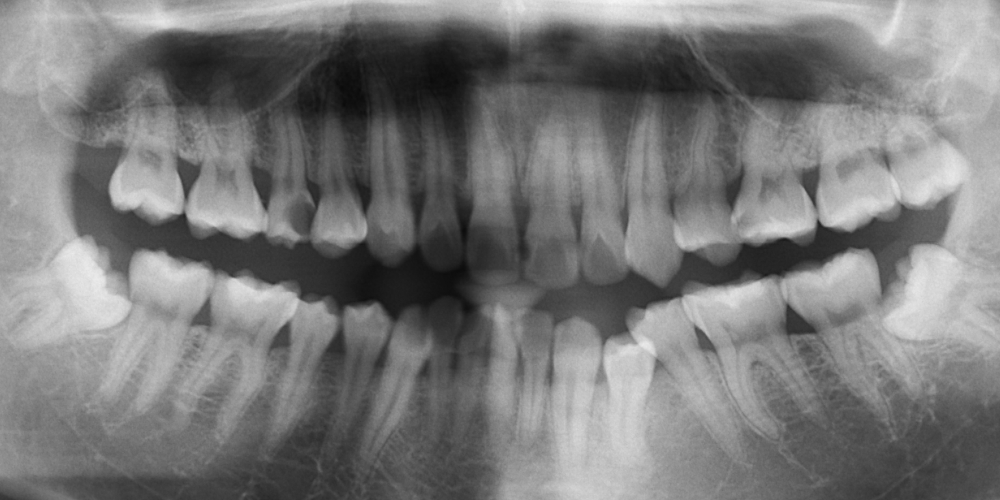
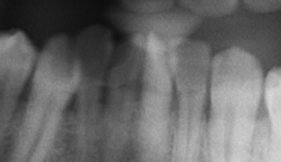
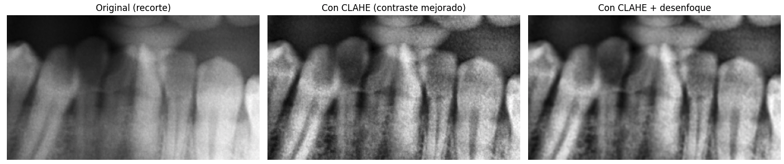
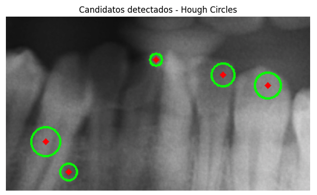
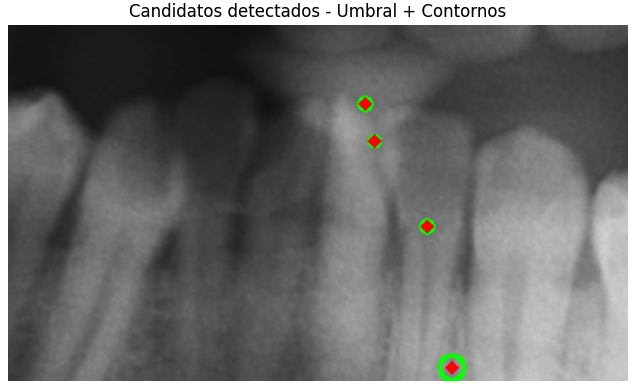
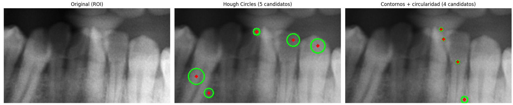

# Detección de centros de objetos circulares en radiografías dentales

## Objetivo

El ejercicio de clase mostró cómo usar la Transformada de Hough para encontrar el centro de objetos circulares en una imagen (ejemplo de las monedas). Esta tarea aplica el mismo principio a un caso distinto: radiografías dentales, donde las posibles caries suelen verse como manchas oscuras (radiolúcidas) de forma más o menos redondeada dentro del diente.

**Aclaración:** este es un ejercicio de procesamiento de imágenes, no una herramienta de diagnóstico. Los candidatos detectados pueden incluir espacios interproximales, restauraciones u otras estructuras normales, no solo caries reales.

## Imagen de trabajo

Se utilizó una radiografía panorámica del dataset público MLUA (Zzz512/MLUA, GitHub), enfocado en segmentación de caries en radiografías panorámicas dentales.

*Figura 1. Radiografía panorámica completa usada como fuente.*

Trabajar sobre toda la panorámica introduce demasiado ruido (hueso, aire, bordes de la mandíbula), así que se recortó una región de interés (ROI) con varios dientes.

*Figura 2. Región de interés recortada para el análisis.*

## Metodología

### 1. Preprocesamiento

Las radiografías dentales tienen bajo contraste comparadas con una foto normal, así que antes de buscar bordes o círculos se aplicó:

- **CLAHE** (ecualización de histograma adaptativa por regiones) para resaltar diferencias de intensidad sin saturar zonas ya claras u oscuras.
- **Desenfoque gaussiano** para suavizar textura fina y ruido, evitando que se confundan con bordes reales.

*Figura 3. Efecto del preprocesamiento sobre el contraste de la imagen.*

### 2. Método A — Hough Circles

Se aplicó `cv2.HoughCircles` directamente sobre la imagen preprocesada, igual que en el ejemplo de las monedas, ajustando `minRadius`/`maxRadius` a un tamaño de lesión mucho menor y bajando `param2` porque los bordes de una lesión son menos definidos que los de una moneda física.

Este método busca **patrones de borde circular**: encuentra círculos donde varios puntos de contorno forman un arco con buen contraste, sin importar si el interior es uniformemente oscuro.

*Figura 4. Candidatos detectados con Hough Circles.*

### 3. Método B — Umbral + contornos + filtro de circularidad

Segundo enfoque, más flexible para manchas que no son círculos perfectos:

1. Umbralización automática con el método de Otsu, para separar zonas oscuras del resto.
2. Limpieza morfológica (apertura) para eliminar puntos sueltos.
3. Detección de contornos de cada mancha resultante.
4. Filtro por forma usando la circularidad `4 · π · área / perímetro²` (1.0 = círculo perfecto), descartando contornos muy pequeños, muy grandes o poco circulares.
5. Centro obtenido con `cv2.minEnclosingCircle` sobre cada contorno que pasa el filtro.

Este método busca **regiones uniformemente oscuras**, sin importar si su borde forma un arco limpio.

*Figura 5. Candidatos detectados con umbral, contornos y filtro de circularidad.*

## Resultados

| Método |  Qué prioriza |
|---|---|
| Hough Circles |  Bordes que forman un arco circular con buen contraste |
| Contornos + circularidad |  Áreas internas uniformemente oscuras, con forma redondeada |

*Figura 6. Resultados de ambos métodos sobre la misma región.*

## Discusión

Los dos métodos detectan conjuntos de candidatos bastante distintos entre sí, lo cual tiene una explicación estructural y no es un error del pipeline:

- Hough Circles puede marcar el borde de una raíz o un espacio interproximal, porque tienen buen contraste en el contorno aunque no sean uniformemente oscuros por dentro.
- El método de contornos puede marcar una zona uniformemente oscura sin un borde circular limpio, que es precisamente el patrón típico de una lesión real (bordes difusos, no bordes duros).

Esta discrepancia sugiere que los candidatos donde **ambos métodos coinciden** son más confiables que los que detecta solo uno, lo cual podría explorarse como un criterio adicional de filtrado en una siguiente iteración.

## Limitaciones

- Los parámetros (radios, umbrales de área y circularidad) se ajustaron manualmente observando esta imagen en particular; con otra radiografía (distinta resolución o contraste) probablemente haya que recalibrarlos.
- Ninguno de los dos métodos distingue caries reales de otras estructuras oscuras y redondeadas (espacios interproximales, restauraciones, superposición de estructuras en la proyección).
- Los resultados son candidatos a revisar por un profesional, no un diagnóstico.

## Posible extensión

El dataset utilizado (MLUA) incluye máscaras de segmentación de caries hechas por expertos (carpeta `labels_cut`). Una siguiente iteración podría comparar los candidatos detectados contra esas máscaras para medir qué tan bien coincide cada método con las lesiones reales marcadas por expertos.

## Referencias

- Dataset: Zzz512/MLUA — Panoramic-Caries-Segmentation, https://github.com/Zzz512/MLUA
- Wang, X., Gao, S., Jiang, K., Zhang, H., Wang, L., Chen, F., Yu, J., Yang, F. (2023). Multi-level uncertainty aware learning for semi-supervised dental panoramic caries segmentation. *Neurocomputing*, 540, 126208.
