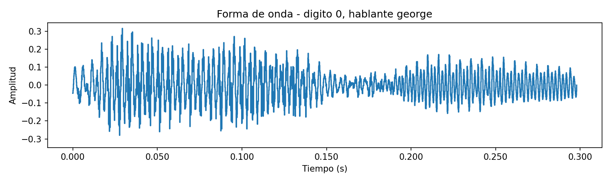
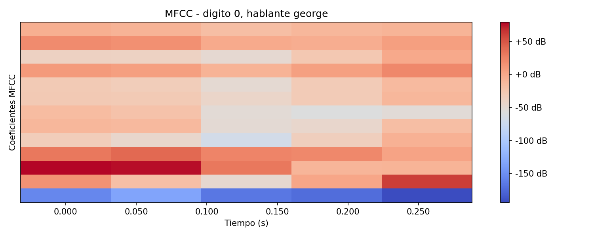
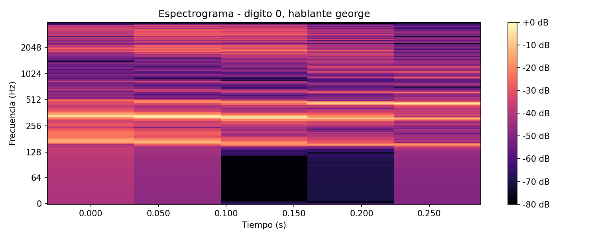
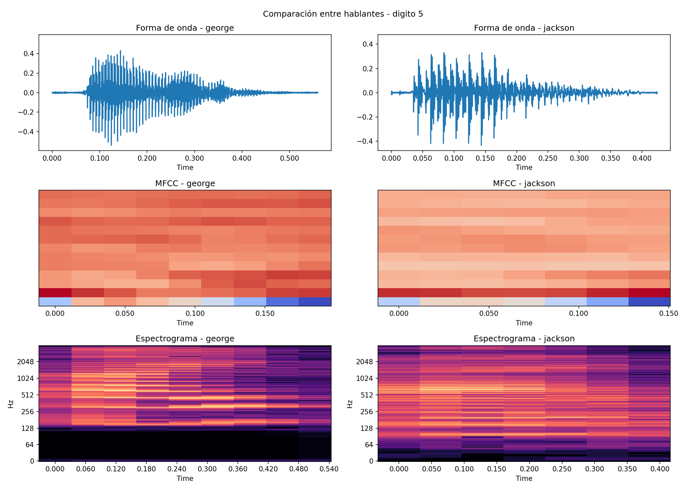
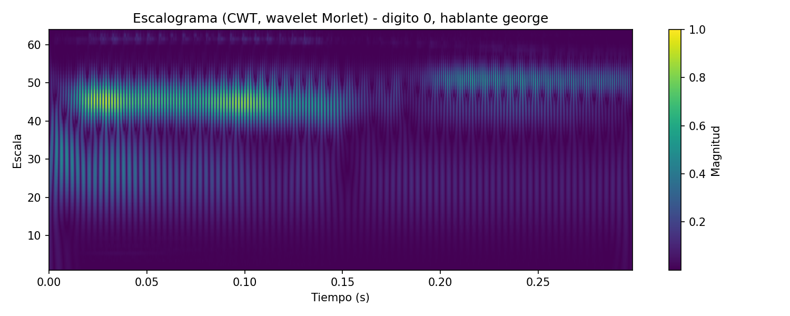
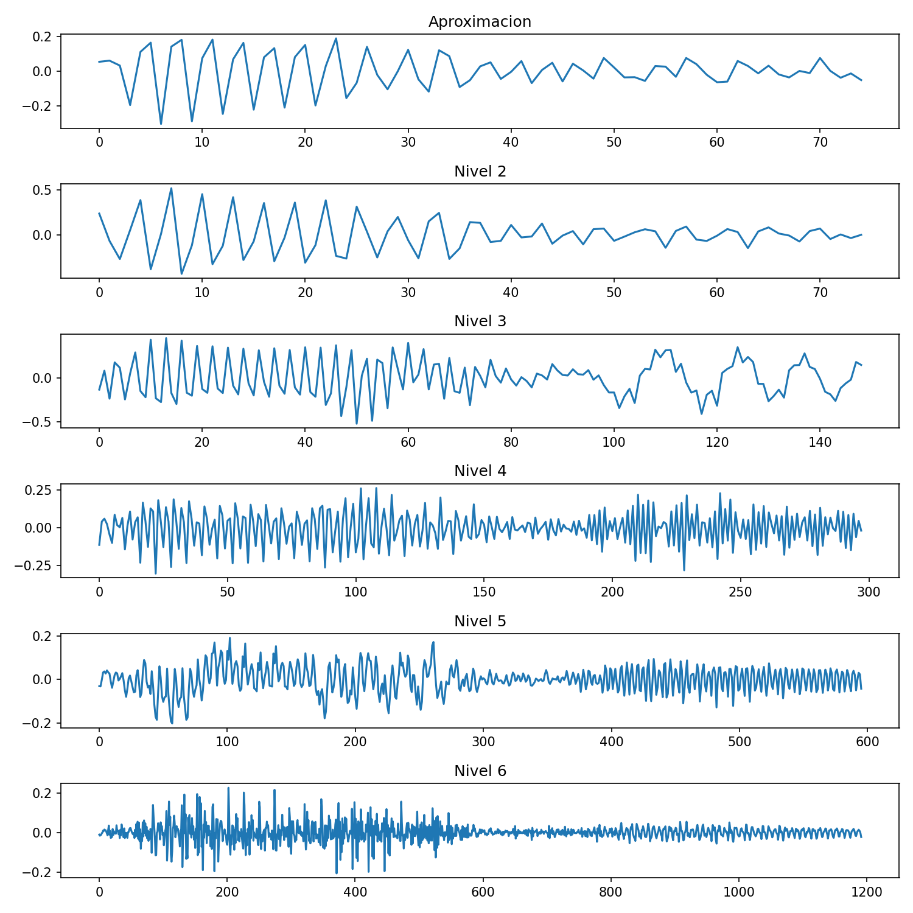
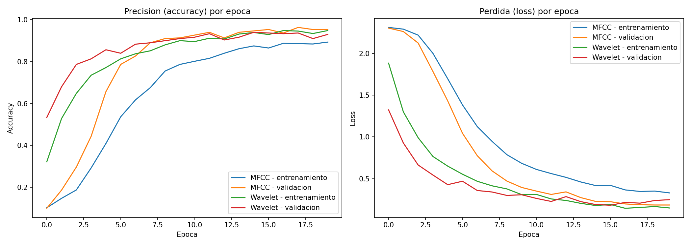
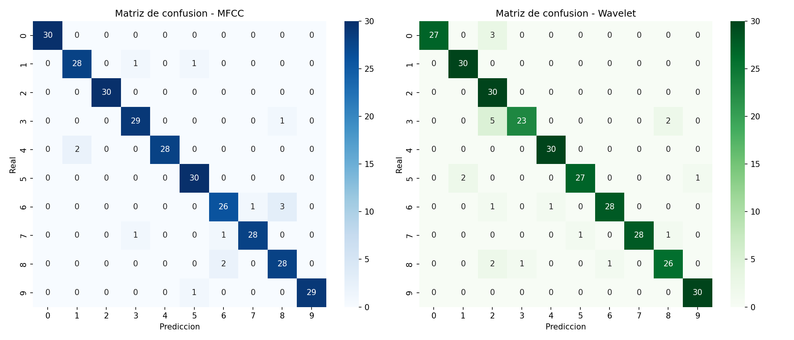

# Reporte: Procesamiento y Clasificación de Audio
---

## 1. Introducción

El objetivo de este trabajo es implementar un flujo completo de procesamiento y clasificación de señales de audio, y evaluar el efecto que tiene la representación de entrada sobre el desempeño de un clasificador.

Se utilizó el *Free Spoken Digit Dataset* (FSDD), un conjunto de 3000 grabaciones de dígitos hablados (0 al 9) por distintos hablantes, en formato `.wav`. Este dataset es equivalente en naturaleza al dataset de dígitos hablados (`spoken_mnist`) revisado en clase, pero de descarga directa y sin dependencias adicionales.

El trabajo se divide en dos partes:

1. **Procesamiento de audio**: exploración de la forma de onda, MFCC (Mel Frequency Cepstral Coefficients) y espectrogramas de las señales, incluyendo una comparación entre distintos hablantes pronunciando el mismo dígito.
2. **Clasificación de audio**: entrenamiento y comparación de dos clasificadores CNN, uno usando MFCC como entrada y otro usando escalogramas obtenidos mediante la transformada wavelet continua (CWT), siguiendo la metodología descrita en el artículo de referencia (Dutt, 2020).

---

## 2. Metodología

### 2.1 Dataset

- **Fuente:** [Free Spoken Digit Dataset](https://github.com/Jakobovski/free-spoken-digit-dataset)
- **Número total de grabaciones:** 3000
- **Clases:** dígitos del 0 al 9
- **Hablantes:** _(completar con los hablantes usados, según la salida del notebook)_
- **Frecuencia de muestreo:** 8000 Hz

### 2.2 Procesamiento de audio

Para cada señal se calcularon las siguientes representaciones, siguiendo lo visto en clase:

- **Forma de onda**: amplitud de la señal en el dominio del tiempo.
- **MFCC**: 13 a 20 coeficientes cepstrales, según la sección del notebook.
- **Espectrograma**: magnitud de la Transformada de Fourier de Tiempo Corto (STFT), expresada en decibeles.
- **Escalograma (CWT)**: magnitud de la transformada wavelet continua con wavelet de Morlet, que captura información conjunta de tiempo y frecuencia.

Adicionalmente, se realizó una comparación directa entre dos grabaciones del mismo dígito pronunciado por hablantes distintos, para observar diferencias de timbre y patrones espectrales entre personas.

### 2.3 Extracción de características para clasificación

Para el entrenamiento de los clasificadores, cada archivo de audio se convirtió en una imagen de tamaño fijo (32x32) mediante dos métodos distintos:

- **Representación MFCC**: 20 coeficientes MFCC, redimensionados y normalizados a escala [0, 1].
- **Representación Wavelet**: escalograma obtenido mediante CWT con wavelet de Morlet, redimensionado y normalizado a escala [0, 1].

Se utilizó un subconjunto balanceado del dataset (_150_ muestras por dígito), dividido en 80% para entrenamiento y 20% para prueba, con estratificación por clase para mantener la proporción de dígitos en ambos conjuntos.

### 2.4 Arquitectura del modelo

Se utilizó la misma arquitectura CNN para ambos experimentos (MFCC y wavelet), de forma que la comparación de resultados dependiera únicamente de la representación de entrada:

- Dos bloques convolucionales (Conv2D + MaxPooling2D), con 16 y 32 filtros respectivamente.
- Una capa densa de 64 neuronas con activación ReLU.
- Una capa de Dropout (0.3) para reducir sobreajuste.
- Una capa de salida con 10 neuronas (una por dígito) y activación softmax.

**Hiperparámetros de entrenamiento:**

| Hiperparámetro | Valor |
|---|---|
| Épocas | _20_ |
| Tamaño de batch | _16_ |
| Optimizador | Adam |
| Función de pérdida | Sparse categorical crossentropy |

---

## 3. Resultados

### 3.1 Procesamiento de audio

**Forma de onda, MFCC y espectrograma de una muestra de ejemplo:**

**Comparación entre hablantes distintos pronunciando el mismo dígito:**

**Escalograma (wavelet) de la señal de ejemplo:**

### 3.2 Clasificación de audio

**Curvas de entrenamiento (accuracy y loss) para ambos modelos:**

**Métricas finales en el conjunto de prueba:**

| Representación | Accuracy (test) | Loss (test) |
|---|---|---|
| MFCC | _0.953333_ | _0.184770_ |
| Wavelet (escalograma) | _0.930000_ | _0.248657_ |

**Matrices de confusión:**

**Reporte de clasificación por dígito (precisión, recall, f1-score):**

Reporte de clasificación — MFCC
| Clase | Precision | Recall | F1-score | Support |
|------:|----------:|-------:|---------:|--------:|
| 0 | 1.000 | 1.000 | 1.000 | 30 |
| 1 | 0.933 | 0.933 | 0.933 | 30 |
| 2 | 1.000 | 1.000 | 1.000 | 30 |
| 3 | 0.935 | 0.967 | 0.951 | 30 |
| 4 | 1.000 | 0.933 | 0.966 | 30 |
| 5 | 0.938 | 1.000 | 0.968 | 30 |
| 6 | 0.897 | 0.867 | 0.881 | 30 |
| 7 | 0.966 | 0.933 | 0.949 | 30 |
| 8 | 0.875 | 0.933 | 0.903 | 30 |
| 9 | 1.000 | 0.967 | 0.983 | 30 |
| **Accuracy** | | | **0.953** | **300** |
| **Macro avg** | **0.954** | **0.953** | **0.953** | **300** |
| **Weighted avg** | **0.954** | **0.953** | **0.953** | **300** |

Reporte de clasificación — Wavelet
| Clase | Precision | Recall | F1-score | Support |
|------:|----------:|-------:|---------:|--------:|
| 0 | 1.000 | 0.900 | 0.947 | 30 |
| 1 | 0.938 | 1.000 | 0.968 | 30 |
| 2 | 0.732 | 1.000 | 0.845 | 30 |
| 3 | 0.958 | 0.767 | 0.852 | 30 |
| 4 | 0.968 | 1.000 | 0.984 | 30 |
| 5 | 0.964 | 0.900 | 0.931 | 30 |
| 6 | 0.966 | 0.933 | 0.949 | 30 |
| 7 | 1.000 | 0.933 | 0.966 | 30 |
| 8 | 0.897 | 0.867 | 0.881 | 30 |
| 9 | 0.968 | 1.000 | 0.984 | 30 |
| **Accuracy** | | | **0.930** | **300** |
| **Macro avg** | **0.939** | **0.930** | **0.931** | **300** |
| **Weighted avg** | **0.939** | **0.930** | **0.931** | **300** |

---

## 4. Hallazgos

Los resultados muestran que la representación mediante MFCC obtuvo un mejor desempeño en el conjunto de prueba respecto a la representación basada en Wavelet. MFCC alcanzó una accuracy de 95.33%, frente al 93.00% obtenido mediante el escalograma Wavelet. Asimismo, presentó una menor función de pérdida (0.1848 vs. 0.2487), lo que indica una mayor capacidad del modelo para realizar predicciones correctas y con menor error utilizando características MFCC

---

## 5. Conclusiones

_(Completar con una síntesis de los resultados: qué enfoque se recomendaría para este tipo de tarea, qué limitaciones tuvo el experimento y qué se podría mejorar en un trabajo futuro, por ejemplo aumentar el número de muestras por clase, probar otras wavelets, o combinar ambas representaciones.)_

---

## 6. Referencias

- Dutt, A. (2020). *Audio Classification Using Wavelet Transform and Deep Learning*. https://adityadutt.medium.com/audio-classification-using-wavelet-transform-and-deep-learning-f9f0978fa246
- Jakobovski. *Free Spoken Digit Dataset (FSDD)*. https://github.com/Jakobovski/free-spoken-digit-dataset
- McFee, B. et al. *librosa: Audio and Music Signal Analysis in Python*. https://librosa.org/
- PyWavelets documentation. https://pywavelets.readthedocs.io/
- Material de clase: Clase 7 y Clase 8, Procesamiento y Clasificación de Datos, UANL.
