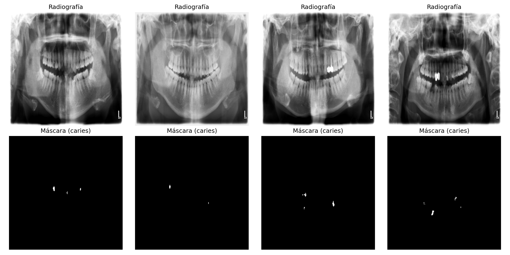
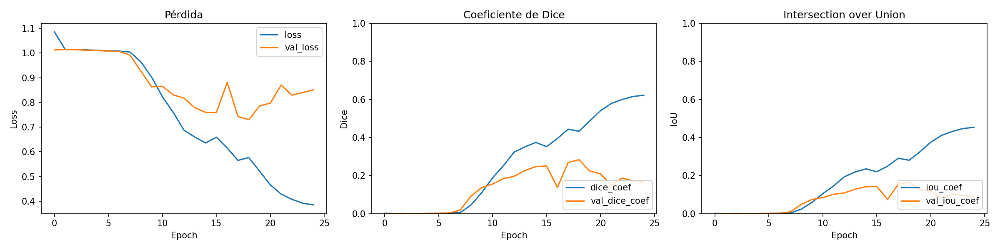
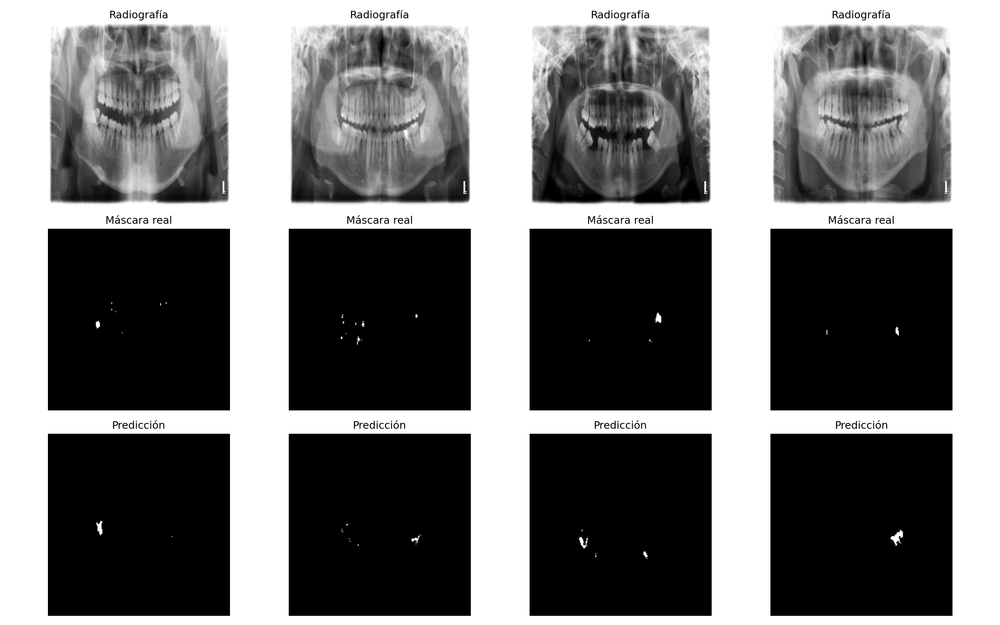

# Segmentación de caries en radiografías panorámicas dentales mediante CNN

---

## 1. Introducción

Las caries dentales son una de las patologías más comunes en odontología, y su detección temprana en radiografías panorámicas es clave para un tratamiento oportuno. Identificarlas manualmente es un proceso lento y dependiente de la experiencia del especialista. En este trabajo se aborda la **segmentación automática de caries** en radiografías panorámicas dentales mediante una red neuronal convolucional (CNN), como parte de la tarea de la clase sobre redes neuronales convolucionales.

A diferencia de la clasificación (asignar una sola etiqueta a toda la imagen), la segmentación produce una máscara pixel a pixel que delimita exactamente la región donde se encuentra la lesión, lo que aporta información espacial mucho más útil para el diagnóstico clínico.

## 2. Objetivo

Diseñar, entrenar y evaluar un modelo de red neuronal convolucional capaz de segmentar regiones con caries en radiografías panorámicas dentales, aplicando los conceptos de CNN, transfer learning y fine-tuning revisados en clase.

## 3. Conjunto de datos

Se utilizó el dataset público **MLUA** ([Zzz512/MLUA](https://github.com/Zzz512/MLUA)), desarrollado para el proyecto *"Multi-level Uncertainty Aware Semi-supervised Learning for Dental Panoramic Caries Segmentation"* (Wang et al., 2023). El repositorio incluye un subconjunto de prueba con radiografías panorámicas dentales junto con sus máscaras de segmentación de caries (ground truth), el cual fue utilizado para este trabajo dado que el conjunto completo de entrenamiento requiere descarga manual desde un repositorio externo.

- **Número de imágenes utilizadas:** [Completar, ej. N imágenes]
- **División entrenamiento / validación:** 80 % / 20 %
- **Tamaño de imagen utilizado:** 224 × 224 píxeles (redimensionado, compatible con VGG16)

### 3.1 Ejemplos del dataset

## 4. Metodología

### 4.1 Preprocesamiento

- Redimensionamiento de imágenes y máscaras a 224 × 224 píxeles.
- Normalización de la imagen al rango [0, 1].
- Binarización de la máscara (fondo = 0, caries = 1).

### 4.2 Arquitectura del modelo

Se implementó una arquitectura tipo **U-Net** utilizando **VGG16 preentrenado en ImageNet** como *encoder* (extractor de características), aplicando el concepto de **transfer learning** visto en clase. El *decoder* se entrenó desde cero, con conexiones tipo *skip connection* entre encoder y decoder para preservar detalles espaciales finos, importantes para delimitar correctamente los bordes de las lesiones.

- **Encoder:** VGG16 (pesos de ImageNet, capas congeladas inicialmente).
- **Decoder:** bloques de `Conv2DTranspose` + concatenación (skip connections) + convoluciones.
- **Capa de salida:** convolución 1×1 con activación sigmoide (mapa de segmentación binario).

### 4.3 Función de pérdida y métricas

Dado que las regiones de caries ocupan una fracción pequeña de la imagen (desbalance de clases), se utilizó una **pérdida combinada** de entropía cruzada binaria + Dice loss, en lugar de solo *accuracy*, que sería engañosamente alto si el modelo simplemente predijera "fondo" en toda la imagen. Como métricas de evaluación se emplearon:

- **Coeficiente de Dice**
- **Intersection over Union (IoU)**
- **Exactitud (accuracy)** por pixel, como referencia complementaria

### 4.4 Entrenamiento y fine-tuning

El entrenamiento se realizó en dos etapas, replicando la progresión vista en clase (CNN desde cero → transfer learning → fine-tuning):

1. **Transfer learning:** se entrenó únicamente el decoder, manteniendo el encoder VGG16 congelado.
2. **Fine-tuning:** se descongelaron las capas del último bloque convolucional de VGG16 (`block5`) y se continuó el entrenamiento con una tasa de aprendizaje reducida, permitiendo un ajuste fino del extractor de características al dominio de radiografías dentales.

## 5. Resultados

### 5.1 Curvas de entrenamiento

### 5.2 Métricas de evaluación (antes de fine-tuning)

| Métrica | Valor |
|---|---|
| Loss (validación) | 0.7303 |
| Dice coefficient | 0.2829 |
| IoU | 0.1650 |
| Accuracy | 0.9979 |

### 5.3 Métricas de evaluación (después de fine-tuning)

| Métrica | Valor |
|---|---|
| Loss (validación) | 0.8458 |
| Dice coefficient | 0.1623 |
| IoU | 0.0885 |
| Accuracy | 0.9988 |

### 5.4 Resultados visuales

## 6. Discusión

Los resultados obtenidos muestran que el modelo basado en U-Net con VGG16 como encoder logró identificar parcialmente las regiones correspondientes a caries; sin embargo, el desempeño en las métricas específicas de segmentación fue limitado. Antes del fine-tuning se obtuvo un Dice coefficient de 0.2829 y un IoU de 0.1650, mientras que después del fine-tuning estos valores disminuyeron a 0.1623 y 0.0885, respectivamente. Esto representa una disminución de aproximadamente 42.6% en Dice y 46.4% en IoU, por lo que, bajo las condiciones utilizadas en este experimento, el fine-tuning no produjo una mejora en la calidad de la segmentación.

Por otro lado, la accuracy aumentó de 0.9979 a 0.9988 después del fine-tuning. Sin embargo, este incremento debe interpretarse con cautela. Debido a que las regiones correspondientes a caries ocupan una proporción pequeña de las imágenes, la mayor parte de los píxeles pertenece al fondo. Por esta razón, un modelo puede obtener una accuracy muy elevada incluso cuando presenta dificultades para identificar y delimitar correctamente las lesiones. En este caso, el comportamiento de Dice e IoU resulta más representativo de la capacidad real del modelo para realizar la segmentación.

La diferencia entre las métricas antes y después del fine-tuning sugiere que descongelar el bloque convolucional block5 de VGG16 y continuar el entrenamiento con una tasa de aprendizaje reducida no fue beneficioso bajo la configuración utilizada. Una posible explicación es que el conjunto de datos empleado fue reducido, lo que puede dificultar la adaptación de las características preentrenadas de ImageNet al dominio específico de las radiografías panorámicas dentales. Además, las características aprendidas originalmente por VGG16 están orientadas a imágenes naturales, por lo que el ajuste de sus últimas capas puede requerir una cantidad mayor y más diversa de imágenes médicas.

Los resultados visuales también deben analizarse en conjunto con las métricas. Un Dice e IoU relativamente bajos indican que, aunque el modelo puede identificar algunas regiones relacionadas con las lesiones, la correspondencia entre las máscaras predichas y las máscaras reales todavía es limitada. Esto puede manifestarse en bordes imprecisos, regiones incompletas o predicciones que no coinciden exactamente con la localización y extensión de las caries.

En consecuencia, los resultados sugieren que el principal reto del modelo no es alcanzar una alta exactitud a nivel de píxel, sino mejorar la identificación y delimitación de los píxeles correspondientes a las lesiones. Para lograrlo, sería conveniente utilizar un conjunto de entrenamiento más amplio y diverso, realizar una búsqueda de hiperparámetros y evaluar diferentes estrategias de fine-tuning. También podrían explorarse otros encoders preentrenados y diferentes funciones de pérdida diseñadas específicamente para problemas de segmentación con fuerte desbalance de clases.

Finalmente, el uso únicamente del subconjunto disponible en el repositorio limita la capacidad de generalización del modelo. El entrenamiento con el conjunto completo de datos permitiría disponer de una mayor variedad de imágenes y patrones de caries, lo que potencialmente permitiría obtener modelos más robustos y representativos del problema real.

## 7. Conclusiones

Los resultados muestran que el modelo obtuvo una accuracy de 99.79% antes del fine-tuning y 99.88% después de este proceso. Sin embargo, las métricas de segmentación presentaron un comportamiento contrario: el Dice coefficient disminuyó de 0.2829 a 0.1623, mientras que el IoU disminuyó de 0.1650 a 0.0885. Por lo tanto, para el experimento realizado, el fine-tuning no mejoró la capacidad del modelo para delimitar correctamente las regiones de caries.

El trabajo permitió aplicar conceptos de CNN, transfer learning, fine-tuning y segmentación semántica a un problema de imágenes médicas, mostrando que una accuracy elevada no necesariamente implica una buena segmentación. Los resultados obtenidos resaltan la necesidad de utilizar métricas específicas como Dice e IoU y de contar con conjuntos de datos suficientemente amplios para desarrollar modelos capaces de segmentar lesiones de manera precisa y generalizable.

## 8. Referencias

- Wang, X., Gao, S., Jiang, K., Zhang, H., Wang, L., Chen, F., Yu, J., & Yang, F. (2023). Multi-level uncertainty aware learning for semi-supervised dental panoramic caries segmentation. *Neurocomputing*, 540, 126208.
- Repositorio del dataset: https://github.com/Zzz512/MLUA
- Ronneberger, O., Fischer, P., & Brox, T. (2015). U-Net: Convolutional Networks for Biomedical Image Segmentation. *MICCAI*.
- Simonyan, K., & Zisserman, A. (2014). Very Deep Convolutional Networks for Large-Scale Image Recognition (VGG16). *arXiv:1409.1556*.
